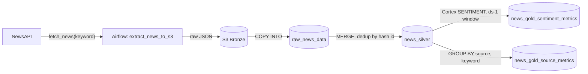

[](https://github.com/Suhasrv2403/News_sentiment_analysis_pipeline/actions/workflows/ci.yml)

# News Intelligence Medallion Pipeline

Automated Airflow pipeline that pulls daily news coverage for a configurable list of keywords, lands it in Snowflake through a Bronze → Silver → Gold medallion architecture, and classifies each day's headlines by AI-generated sentiment — no manual step between "NewsAPI has new articles" and "a Gold table has today's sentiment and volume numbers ready for BI." Idempotent by design (hash-based article IDs, incremental Gold loads), so re-running any day is safe. Orchestrated by Apache Airflow (Astronomer), with unit + structural tests and CI.

**Stack:** Python · Apache Airflow (Astronomer) · AWS S3 · Snowflake · Snowflake Cortex (LLM sentiment) · pytest · GitHub Actions

## Why this matters

Tracking how a brand, product, or topic is being covered in the news is usually a manual, after-the-fact exercise — someone reads headlines and eyeballs the tone. This pipeline turns that into a number a dashboard can show every morning: how many articles ran on a given keyword yesterday, and whether the coverage read positive, negative, or neutral, broken down by source. That turns "did coverage of X take a negative turn this week" from a research task into a Snowflake query.

## Architecture



Bronze is the raw JSON landing zone; Silver is deduplicated and structured; Gold is pre-aggregated for direct BI consumption. Full design rationale (idempotency, incremental loading, sentiment thresholding) is in [docs/THEORY.md](docs/THEORY.md).

## How to run

1. `cd news_sentiment_analysis`
2. Copy the config template and fill in your NewsAPI key + S3 bucket name: `cp configs/config.example.yaml configs/config.yaml`
3. Run `snowflake_setup.sql` once against your Snowflake account — creates the stage, file format, and Bronze/Silver/Gold tables.
4. Set up Airflow connections `aws_default` and `snowflake_conn` (via the Astro/Airflow UI once the project is running).
5. `astro dev start` — the DAG `news_intelligence_pipeline` runs on an `@daily` schedule.
6. Tests: from `news_sentiment_analysis/`, `pip install -r requirements.txt pytest apache-airflow apache-airflow-providers-amazon apache-airflow-providers-common-sql` then `pytest -v`.

## At scale

Today the DAG loops over keywords in a single Python task and talks to Snowflake through one hardcoded connection ID — fine for a handful of keywords in one environment. At scale, keyword extraction would move to dynamically mapped Airflow tasks (parallel, independently retryable per keyword), connections would move to Airflow's secrets backend with per-environment (dev/staging/prod) IDs, and Bronze would need a dedup check at write time instead of relying entirely on Silver's `QUALIFY` step. Missed-run backfill tooling and DAG-failure alerting would also need to be built out. Full limitations list in [docs/THEORY.md](docs/THEORY.md).

## Repo structure

```text
.
├── LICENSE
├── README.md
├── docs/
│   └── THEORY.md                      # Design rationale, limitations, references
└── news_sentiment_analysis/           # Astro/Airflow project root
    ├── dags/
    │   └── news_extraction_dag.py     # Airflow DAG — the pipeline's entry point
    ├── include/
    │   ├── scrapper.py                # NewsScraper: NewsAPI client + normalization
    │   └── settings.py                # Loads configs/config.yaml into constants
    ├── configs/
    │   ├── config.example.yaml        # Checked-in config template
    │   └── config.yaml                # Real config (gitignored, not in repo)
    ├── data/
    │   └── sample_newsapi_response.json  # Example of the JSON scrapper.py produces
    ├── tests/
    │   ├── test_scrapper.py           # NewsScraper unit tests + Silver contract test
    │   ├── test_settings.py           # Config loading / defaults
    │   └── test_dag_structure.py      # DAG structure, SQL guards, orchestration
    ├── snowflake_setup.sql            # Canonical schema — run once per environment
    └── requirements.txt
```
